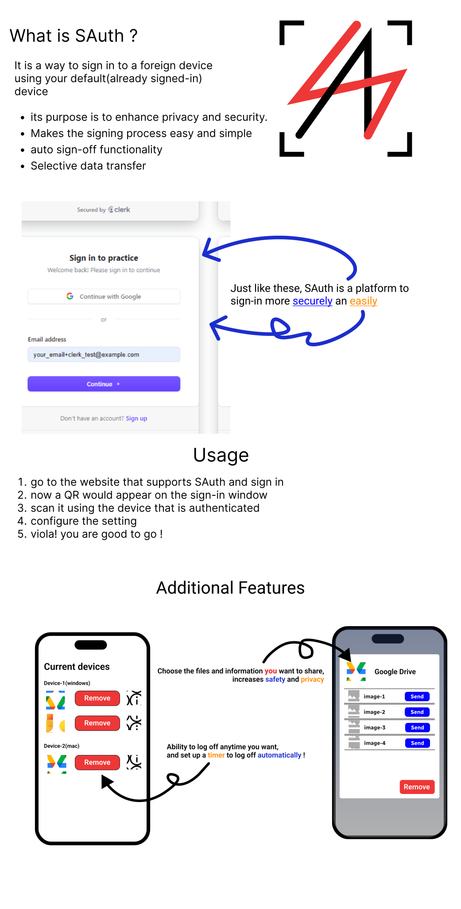

# SAuth


> SAuth helps you to sign in to other devices using your root(main) device
> with your root device alone you can control the sign-in logs hassel free



## How to use

### file structure

```
📦SAuth
 ┣ 📂2ndParty
 ┣ 📂3rdParty
 ┣ 📂img
 ┃ ┣ 📜Intro.svg
 ┃ ┗ 📜logo.svg
 ┣ 📂SAuth
 ┗ 📜README.md
```

### Pre-requisites

-   node
-   NPM
-   an image uploader (preferabily [uploadthing](https://uploadthing.com/))

### Process

1. install or clone the repository
2. cd `SAuth` directory
3. change the name of `.env.sample` to `.env`
4. acquire API keys from your image aploading service (like [cloadinary](https://cloudinary.com/) or [uploadthing](https://uploadthing.com/))
5. make changes to `.env` and put api keys
6. enter the following command

```bash
npm i && npm run dev
```

7. you are ready
